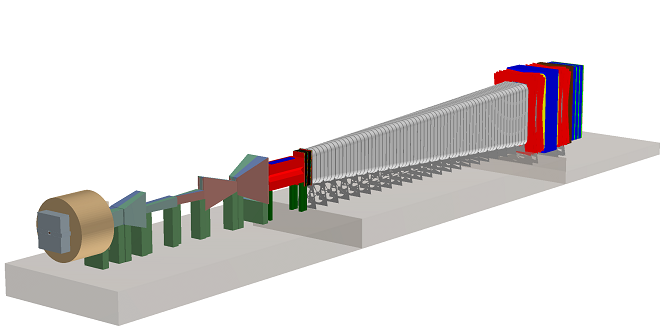
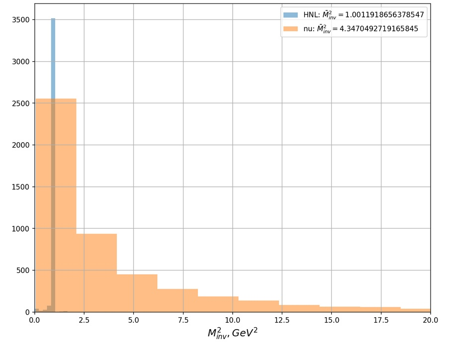
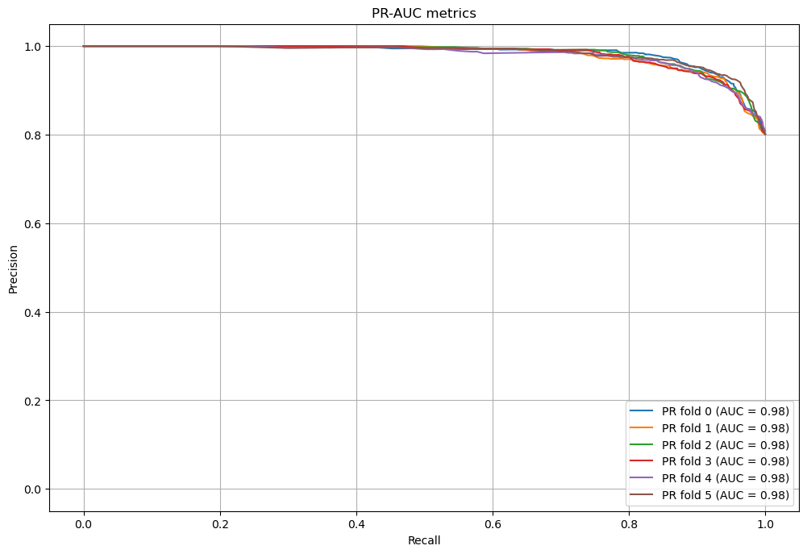
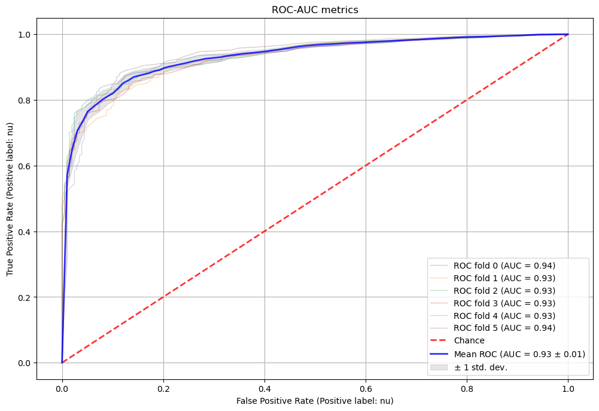

<h1 align="center">
Sensitivity of the SHiP experiments with the optimized geometry to Heavy Neutral Leptons
</h1>

Eduard Ursov, Anna Anokhina, Vasilisa Gulyaeva, ...

<h2 align="center">
Abstract
</h2>

Heavy Neutral Leptons (HNLs) are hypothetical particles predicted by
many extensions of the Standard Model. These particles can, among other things,
explain the origin of neutrino masses, generate the observed matter-antimatter asymmetry in the Universe and provide a dark matter candidate.
The SHiP experiment will be able to search for HNLs produced in decays of charm and beauty
mesons and travelling distances ranging between $O(50 m)$ and tens of kilometers
before decaying. We present the updated estimates of the HNL signal at the SHiP experiment with the updated shortened design. Reoptimization of the muon shield using bayesian optimization was carried out. Using machine learning methods, a classifier that is able to distinguish HNL events from neutrino background events based on the observed parameters with high precision has been developed.

<h2 align="center">
Introduction
</h2>

Dark matter is a substance which fills the Universe and is invisible in electromagnetic and neutrino radiation but shows itself through gravitational forces . It is used to explain various astrophysical and cosmological phenomena such as distinctive shapes of the rotation curves of galaxies, dynamics of galaxy clusters, and effects of gravitational lensing.
  
Cross section of non-gravitational interaction of hypothetical dark matter particles with Standard Model (SM) matter has to be extremely small, which is why these particles are called feebly interacting particles (FIPs) [1]. In this work we consider FIPs with masses of approximately 1 GeV as heavy neutral lepton (LDM) [2]. The models describing HNL require the existence of mediators, special particles [3], through which HNL interacts with baryonic matter.
There are many experiments aiming at detecting dark matter through its non-gravitational interaction with SM matter. Neutrino fixed target experiments with high luminosity (MiniBooNE [4] and T2K [5]) are of particular interest for LDM studies. One of the tasks of the upcoming SHiP experiment (fig. 1) [6] at CERN, which will use a proton beam with incident energy of 400 GeV, is HNL detection.
 

Fig. 1. SHiP experiment layout.

In this work a full simulation of HNL events and neutrino background events at the SHiP experiment was carried out using Monte-Carlo (MC) simulator Fairship (https://github.com/ShipSoft/FairShip) based on MC simulators GEANT4, PYTHIA, and GENIE, so let us provide a brief description of this experiment. The defining parameter for fixed target experiments is POT (protons on target), its value has a direct influence on the sensitivity of an experiment to signal events. For SHiP POT will be $2\dot 10^20$ during the first five years of its work.
  
The main steps of production and detection of HNL and neutrinos in the SHiP experiment are as follows. A 400 GeV proton beam collides with a hybrid target made of tungsten and molybdenum. As a result of the collision of the proton beam with target nuclei, secondary particles (in particular, FIPs and neutrino) are produced. Secondary hadrons and muons are slowed down and deflected along the way to the detector with the help of various protective systems. Then, HNL and neutrinos reach an emulsion neutrino detector named SND (Scattering and Neutrino Detector). SND is based on the Emulsion Cloud Chamber technique and consists of a sequence of passive material (lead) plates, between which emulsion films are inserted. This technology has already proved itself in the OPERA experiment, which studied neutrino oscillations [7]. The main advantage of the emulsion detector is its high spatial resolution, which allows one to obtain a precise 3-dimensional reconstruction of the event down to several microns. HNL decay into Standard Model particles, while neutrinos scatter on the lead nuclei and produce secondary particles via inelastic interactions. Then, secondary particles produced in the SND travel through a vacuum decay volume (~50m) to the tracking stations. Analysis of the signal produced by secondary particles will enable the reconstruction of primary particles and detect HNLs.

The main task of this work is to implement the new version of the SHiP experiment which is now to be installed in ECN3 room, to estimate the acceptance of the experiment to HNLs, and to study the background events including neutrino and muon background. The paper is organized as follows: in Section 2 we discuss the Light Dark Matter model and the Drell-Yan cross section properties. The simulation steps with LDM features, LDM deep inelastic scattering and secondary particle production are described in Section 3. Neutrino event simulation procedure done with the help of GENIE generator is presented in Section 4 (see [9]). It is important to obtain the LDM signatures in the SND detector and compare them to background neutrino events. Such signatures are presented in Section 5. The sensitivity of our LDM production and detection scheme are discussed in Section 6. The results of LDM event selection are also shown there. Finally, we conclude in Section 7.

<h2 align="center">
Simulation of HNL and neutrino events
</h2>

  
<h3>
HNL simulation
</h3>
A detailed Monte-Carlo simulation suite for the SHiP experiment, FairShip, was developed based on the FairRoot software framework. In FairShip simulations primary collisions of protons are generated with Pythia8 and the subsequent propagation and interactions of particles simulated with GEANT4. Neutrino interactions are simulated with GENIE; heavy flavour production and inelastic muon interactions with Pythia 6 and GEANT4. Secondary heavy flavour production in cascade interactions of hadrons originated by the initial proton collision is also taken into account, which leads to an increase of the overall HNL production fraction. The SHiP detector response is simulated using GEANT4. O(1) of HNL events were simulated totally.

<h3>
Neutrino simulation
</h3>  
When neutrinos interact with target nuclei or electrons of the detector through charged current (CC), the main signature of a neutrino event is the production of a high-energy charged lepton, which wouldn’t be present in the case of an LDM event. This charged lepton would be most likely identified in ECC.
However, in the case of a neutral current (NC) interaction the identification of background neutrino events is a bit more complicated. For neutrinos scattering on electrons it is still possible to simulate the spectra and understand that LDM particles (which have higher masses then neutrinos) contribute to the recoil electron’s energy. But for the case of DIS of neutrino on nuclei one should carry out a thorough research to create specific criteria for distinguishing LDM events from neutrino background events.
In this paper we used GENIE Monte-Carlo generator to simulate neutrino interactions with the material of the detector. Energy spectra of neutrinos produced in the target and reached the detector, were taken from SHiP Technical Proposal.

Full modeling of neutrino events consists of several steps:

<ol>
  <li>Obtaining the spectra of neutrinos reaching the detector;</li>
  <li>Calculating cross sections of interactions of 0–150 GeV neutrinos of various flavors with lead nuclei at energies 0–150 GeV;</li>
  <li>Simulating interactions of neutrinos of various flavors with lead nuclei in the detector.</li>
</ol>

For DIS modeling at high energies GENIE uses the so-called Bodek–Yang model, for hadronization modeling—"AGKY" model, which, in turn, utilizes PYTHIA6 in the total invariant system mass range W>3 GeV.
GENIE provides precalculated cross sections of neutrino interactions for energies up to 100 GeV. In order to simulate the processes with high energies, one has to obtain the splines of corresponding cross sections. We calculated cross sections of neutrinos of three different flavors in the 0–150 GeV energy range using the `gmskspl` command embedded in the GENIE code.
Using the obtained cross sections, we have simulated neutrino background events.

For classification problem muon+pion events for HNLs and neutrino were chosen due to their similarity for HNLs and neutrino.
  
<h2 align="center">
Processing Monte-Carlo data and development of a classification  
</h2>

Raw Monte-Carlo data is stored in `data` folder. It was processed in `process_data.ipynb` jupyter notebook. As a result, 5 features were used to create a dataset for classification problem: an angle between muon and pion, a pseudorapidity of the system muon+pion, a transversal momentum, a sum of pseudorapidities of 2 particles, and a sum Pz for them. The energy was not used due to complexety of the energy reconstruction of muons. If we define energy, we would calculate a squared invariant mass of the system and easily recognise what was a primary particle. Fig. 2 shows the distribution of the squared invariant mass. 
 

Fig. 2. Distribution of squared invariant mass for HNLs and neutrino.

  
  
For classification problem Random Forest Classifier of python machine learning library `sklearn` was used. Due to a weak imbalance of classes in the dataset we used both precision-recall (PR) (Fig. 3), receiver operating characteristic (ROC) (Fig. 4). Validation was carrried out using `StratifiedKFold` cross-validation that is applicable in binary classification. Also, confidence intervals for Matthews correlation were calculated using bootstrap approach. 

Fig. 3. Precision-recall metrics for binary classification

 

Fig. 4. ROC metrics for binary classification

The results of Matthews correlation is rather poor: (0.56, 0.65) with confidence level of 0.05 and has to be increased by optimizing hyperparameters.
